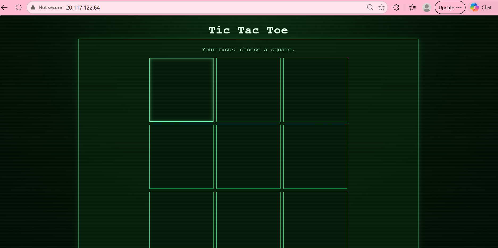

# Azure 2-Tier App Deployment Documentation

## Overview

This documents the process of re-deploying the TicTacToe 2-tier application on Microsoft Azure, having previously deployed it on AWS. The aim was to consolidate what we had learned and show how transferable the skills and scripts are across different cloud providers.

---

## AWS vs Azure - Key Differences

| | AWS | Azure |
|---|---|---|
| Virtual Machine | EC2 | Virtual Machine |
| Networking | VPC | VNet (Virtual Network) |
| Firewall rules | Security Group | NSG (Network Security Group) |
| Default username | ubuntu | adminuser |
| Resource grouping | Not required | Resource Group (tech610) |
| Region used | Ireland | UK South |
| VM size | t3.micro | Standard_B1s |
| SSH key format | .pem | Ed25519 |
| Script working directory | / (root) | /home/adminuser |
| DB internet access | Works out of the box | Needed temporary public IP |

---

## Architecture

```
Internet
    │
    ▼
App VM (Ubuntu 24 - public subnet)
├── nginx (port 80) ← reverse proxy
├── TicTacToe Node.js app (PM2, port 3000)
└── MONGODB_URI → DB VM private IP:27017
         │
         │ private VNet
         ▼
DB VM (Ubuntu 24 - private subnet)
└── MongoDB 8.2.5 (bindIp: 0.0.0.0, port 27017)
```
---

## Network Security Group Rules

### App VM NSG
| Port | Protocol | Source | Purpose |
|---|---|---|---|
| 22 | SSH | Any | Terminal access |
| 80 | HTTP | Any | nginx web server |
| 3000 | TCP | Any | Node.js app |

### DB VM NSG
| Port | Protocol | Source | Purpose |
|---|---|---|---|
| 22 | SSH | Any | Terminal access |

> Note: Port 27017 (MongoDB) does NOT need to be open in the DB VM NSG. This is because both VMs are inside the same VNet and VMs within the same VNet can communicate freely on any port without NSG rules. The DB VM is in a private subnet with no public IP so it cannot be reached from the internet at all — making it more secure than on AWS.

---

## Step 1 - Create SSH Key Pair

The SSH key was generated through the Azure GUI when creating the first VM. Azure generates an Ed25519 key pair and downloads the private key automatically.

- Key name: `sumiya-azure-tech610-key`
- Private key saved to: `~/.ssh/sumiya-azure-tech610-key.pem`

---

## Step 2 - Create the VNet

A Virtual Network (VNet) with two subnets was created to separate the app and database layers.

1. Azure portal → search **Virtual Networks** → Create
2. Resource group: `tech610`
3. Name: `tech610-sumiya-2-subnet-vnet`
4. Region: UK South
5. Address space: `10.0.0.0/16`
6. Two subnets created:

| Subnet | Name | Address Range | Purpose |
|---|---|---|---|
| First | public-subnet | 10.0.2.0/24 | App VM |
| Second | private-subnet | 10.0.3.0/24 | DB VM |

---

## Step 3 - Create the DB VM

| Setting | Value |
|---|---|
| Resource group | tech610 |
| VM name | tech610-sumiya-db-vm |
| Region | UK South |
| Image | Ubuntu Server 24.04 LTS - x64 Gen2 |
| Security type | Standard |
| Size | Standard_B1s |
| Username | adminuser |
| SSH key | sumiya-azure-tech610-key |
| OS disk | Standard SSD |
| VNet | tech610-sumiya-2-subnet-vnet |
| Subnet | private-subnet |
| Public IP | None |
| Tag | Owner: Sumiya |

---

## Step 4 - Create the App VM

| Setting | Value |
|---|---|
| Resource group | tech610 |
| VM name | tech610-sumiya-ttt-app-vm |
| Region | UK South |
| Image | Ubuntu Server 24.04 LTS - x64 Gen2 |
| Security type | Standard |
| Size | Standard_B1s |
| Username | adminuser |
| SSH key | sumiya-azure-tech610-key |
| OS disk | Standard SSD |
| VNet | tech610-sumiya-2-subnet-vnet |
| Subnet | public-subnet |
| Public IP | Yes — 20.117.122.64 |
| Tag | Owner: Sumiya |

---

## Step 5 - Deploy MongoDB on the DB VM

### Blocker - DB VM Had No Internet Access

The DB VM was in the private subnet with no public IP so it couldn't reach the internet to download MongoDB packages. This was a key difference from AWS.

### How We Solved It

Temporarily added a public IP to the DB VM's primary IP configuration:

1. Azure portal → DB VM → Networking → Network settings
2. Click network interface
3. Click IP configurations
4. Click ipconfig1
5. Associate a new public IP: `db-vm-public-ip`
6. Save

This gave the DB VM temporary internet access to run the script.

### Fix Key Permissions - Blocker

When copying the private key to the App VM to use as a jump box, SSH rejected it because the permissions were too open:

```
WARNING: UNPROTECTED PRIVATE KEY FILE!
Permissions 0644 for key are too open
```

Fix:
```bash
chmod 600 ~/.ssh/sumiya-azure-tech610-key.pem
```

### Jump Box - Connecting to DB VM via App VM

Since the DB VM had no public IP initially, we used the App VM as a jump box:

```bash
# Step 1 — Copy private key to App VM
scp -i ~/.ssh/sumiya-azure-tech610-key.pem \
  ~/.ssh/sumiya-azure-tech610-key.pem \
  adminuser@20.117.122.64:/home/adminuser/.ssh/

# Step 2 — Copy DB script to App VM
scp -i ~/.ssh/sumiya-azure-tech610-key.pem \
  ~/tech610/prov-db.sh \
  adminuser@20.117.122.64:/home/adminuser/

# Step 3 — SSH into App VM
ssh -i ~/.ssh/sumiya-azure-tech610-key.pem adminuser@20.117.122.64

# Step 4 — Fix key permissions on App VM
chmod 600 ~/.ssh/sumiya-azure-tech610-key.pem

# Step 5 — Copy script to DB VM
scp -i ~/.ssh/sumiya-azure-tech610-key.pem \
  ~/prov-db.sh \
  adminuser@10.0.3.4:/home/adminuser/

# Step 6 — SSH into DB VM
ssh -i ~/.ssh/sumiya-azure-tech610-key.pem adminuser@10.0.3.4
```

### Run the DB Script

```bash
chmod +x prov-db.sh
./prov-db.sh
```

### Verify MongoDB is Running

```bash
sudo systemctl status mongod
sudo cat /etc/mongod.conf | grep bindIp
# Should return: bindIp: 0.0.0.0
```

### After Script Ran Successfully

Removed the temporary public IP from the DB VM and moved it back to the private subnet:

1. Azure portal → DB VM → Networking → Network settings
2. Click network interface → IP configurations
3. Click ipconfig1
4. Dissociate public IP
5. Change subnet back to private-subnet
6. Save

DB VM private IP after moving back: `10.0.3.4`

---

## Step 6 - Deploy the App VM

### SCP the App Script

```bash
scp -i ~/.ssh/sumiya-azure-tech610-key.pem \
  ~/tech610/tictactoe.sh \
  adminuser@20.117.122.64:/home/adminuser/
```

### SSH into App VM

```bash
ssh -i ~/.ssh/sumiya-azure-tech610-key.pem adminuser@20.117.122.64
```

### Run the Script

```bash
chmod +x tictactoe.sh
./tictactoe.sh
```

### Blocker — Wrong cd Path

On AWS, User Data scripts run from `/` (root) so the path was:
```bash
cd /tech610-tic-tac-toe/app  ← works on AWS
```

On Azure, scripts run from `/home/adminuser` so the path needs to be:
```bash
cd ~/tech610-tic-tac-toe/app  ← works on Azure
```

This caused `npm install` and `pm2 start` to fail because they were running from the wrong directory.

### Manual Fix

```bash
cd ~/tech610-tic-tac-toe/app
export MONGODB_URI=mongodb://10.0.3.4:27017/tic-tac-toe
npm install
pm2 kill
pm2 start index.js
```

### Verify App is Running

```bash
pm2 status
curl http://localhost:80
```

---

## Result Screenshot




- TicTacToe app running on Azure
- Connected to MongoDB on DB VM
- nginx reverse proxy working
- 2-tier architecture across public and private subnets

---

## Key Lessons Learned

### 1 - Script Working Directory Differs Between AWS and Azure
- AWS User Data runs from `/` so absolute paths like `/tech610-tic-tac-toe/app` are needed
- Azure runs from `/home/adminuser` so relative paths like `~/tech610-tic-tac-toe/app` work
- Always check the working directory when moving scripts between cloud providers

### 2 - Private Subnet VMs Have No Internet Access
- On AWS, EC2 instances in a VPC can reach the internet by default
- On Azure, VMs in a private subnet with no public IP cannot reach the internet
- Solution: temporarily add a public IP to install packages, then remove it after

### 3 - Key Permissions Must Be Restricted
- SSH private keys must have permissions `600` (owner read/write only)
- If copied to another machine the permissions reset to `644` which SSH rejects
- Always run `chmod 600 ~/.ssh/keyname.pem` after copying a key

### 4 - Port 27017 Not Needed in Azure NSG
- On AWS we opened port 27017 in the DB security group
- On Azure this is not needed because both VMs are in the same VNet
- VMs in the same VNet communicate freely without NSG rules
- The private subnet adds an extra layer of security by blocking all public internet access

### 5 - Jump Box Pattern
- When a VM has no public IP, use another VM in the same network as a jump box
- SSH into the public VM first, then SSH from there into the private VM using its private IP
- This is a common and secure pattern in production environments

---

## Updated tictactoe.sh for Azure

```bash
#!/bin/bash

# ── System Update
sudo apt update -y
sudo apt upgrade -y

# ── Install nginx
sudo apt install nginx -y

# ── Configure Nginx as Reverse Proxy
sudo sed -i 's|try_files $uri $uri/ =404;|proxy_pass http://localhost:3000;|' /etc/nginx/sites-available/default
sudo nginx -t
sudo systemctl restart nginx

# ── Install Node.js v20
curl -sL https://deb.nodesource.com/setup_20.x -o nodesource_setup.sh
sudo bash nodesource_setup.sh
sudo apt install nodejs -y

# ── Clone the app from GitHub
git clone https://github.com/davidrichardharvey/tech610-tic-tac-toe

# ── Install dependencies and start the app
cd ~/tech610-tic-tac-toe/app
sudo npm install pm2 -g
npm install

# ── Set MongoDB connection string
export MONGODB_URI=mongodb://10.0.3.4:27017/tic-tac-toe

pm2 kill
pm2 start index.js
```

> Key difference from AWS version: `cd ~/tech610-tic-tac-toe/app` instead of `cd /tech610-tic-tac-toe/app`