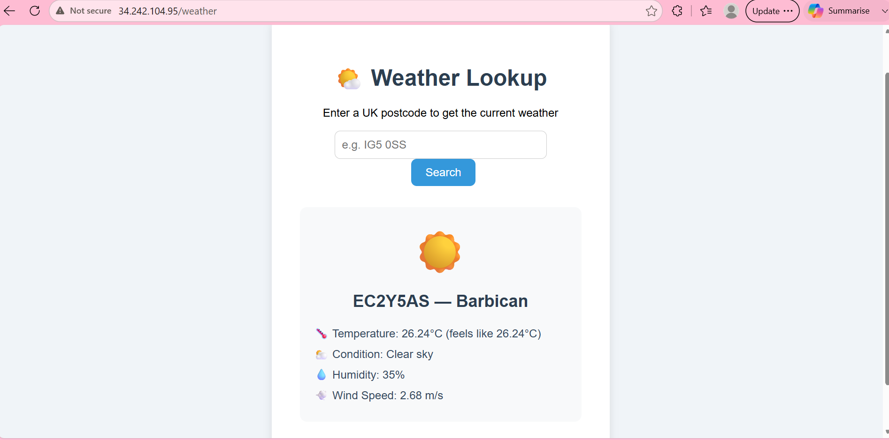

# Flask Weather App — Cloud Deployment

## Architecture
User → Port 80 → Nginx (reverse proxy) → Port 5000 → Flask App (Gunicorn)

## EC2 Setup
- AMI: Ubuntu 24 LTS
- Instance type: t3.micro
- Key pair: sumiya-tech610-key.pem

## Security Group Rules
- Port 22: SSH (My IP only)
- Port 80: HTTP (All traffic)
- Port 5000: Flask app (All traffic)

## Files Required
- `flask_app.py` — main Flask application
- `weather_project.py` — postcode and weather API logic
- `gitignore_api_key` — contains the OpenWeather API key (not pushed to GitHub)
- `requirements.txt` — Python dependencies
- `flask-deploy.sh` — automated deployment script
- `templates/index.html` — frontend HTML page

## Dependencies
- Python 3
- pip
- venv (Python virtual environment)
- Flask
- Requests
- Gunicorn (replaces PM2 for Python apps)
- Nginx (reverse proxy)

## Deployment Steps

### Step 1 — Launch EC2 instance
- AMI: Ubuntu 24 LTS
- Instance type: t3.micro
- Configure security group with ports 22, 80, and 5000

### Step 2 — SCP files to EC2
Run from your local machine in Git Bash:

```bash
scp -i ~/.ssh/sumiya-tech610-key.pem flask_app.py weather_project.py gitignore_api_key requirements.txt flask-deploy.sh ubuntu@<your-ip>:/home/ubuntu/
```

Then copy the templates folder:

```bash
scp -i ~/.ssh/sumiya-tech610-key.pem -r templates ubuntu@<your-ip>:/home/ubuntu/
```

### Step 3 — SSH into the instance

```bash
ssh -i ~/.ssh/sumiya-tech610-key.pem ubuntu@<your-ip>
```

### Step 4 — Verify files arrived

```bash
ls
```

### Step 5 — Make script executable and run it

```bash
chmod +x flask-deploy.sh
./flask-deploy.sh
```

### Step 6 — Visit in browser (http://IP-ADDRESS)

## What Changed vs TicTacToe Deployment
- Runtime: Node.js → Python 3
- Process manager: PM2 → Gunicorn
- Port: 3000 → 5000
- Packages: npm install → pip install -r requirements.txt
- Virtual environment added for Python dependency isolation

## Step by step example of process
- Create new instance:

Security guidelines
    port 22 - SSH - My IP only
    port 80 - HTTP - Anywhere
    port 500 - TCP - Anywhere

- after new IP id running: 
```bash
scp -i ~/.ssh/sumiya-tech610-key.pem flask_app.py weather_project.py gitignore_api_key requirements.txt flask-deploy.sh ubuntu@34.242.104.95:/home/ubuntu/
```
- copy templates folder seperately:
```bash
scp -i ~/.ssh/sumiya-tech610-key.pem -r \ templates \ ubuntu@34.242.104.95:/home/ubuntu/
```

- ssh and verify files arrived:
```bash
ssh -i ~/.ssh/sumiya-tech610-key.pem ubuntu@34.242.104.95

ls
```

- run the script: 
```bash
chmod +x flask-deploy.sh
./flask-deploy.sh
```

## View of Flask Weather App Deployed

Below is a screenshot of my flask application deployed when using IP address in browser:



