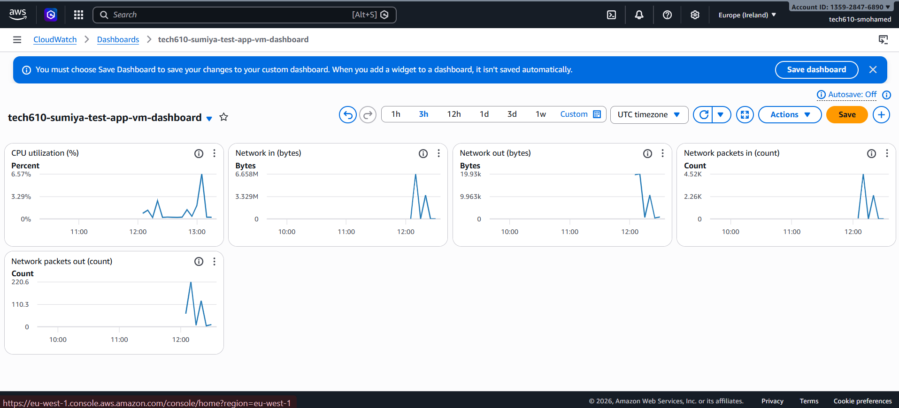
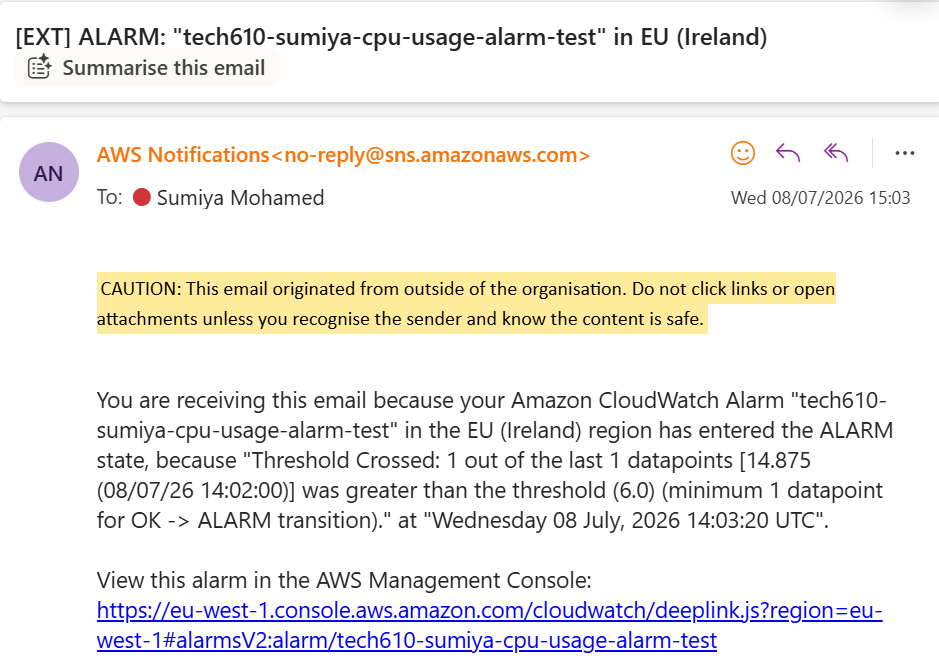
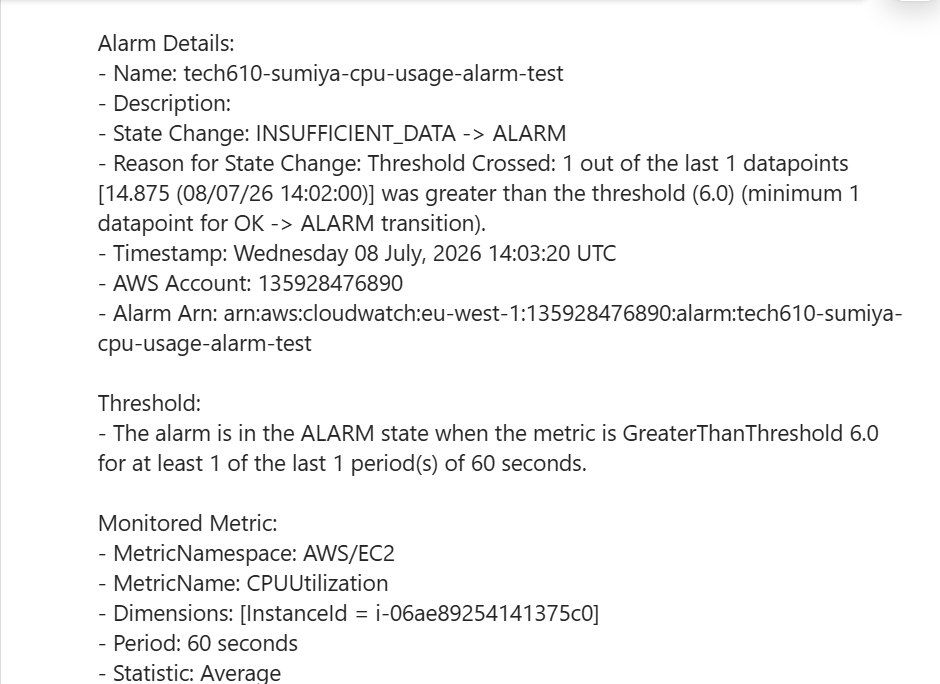

# Monitoring, Alert Management and Auto Scaling

---

## What is Performance Testing?

Performance testing is about asking: **"Is the app working well generally?"**

It includes two main types:

- **Load testing** - asking "Can the app handle the usual amount of traffic?"
- **Stress testing** - asking "How much traffic can the app handle before it breaks, and what happens when it does break?"

### What We Did
- Concentrated on **load testing**
- Used a tool called **Apache Bench (ab)**
- Monitored what happened to CPU usage during the tests using **AWS CloudWatch**

---

## Worst to Best: Monitoring and Responding to Load/Traffic

From worst to best practice:

| Level | Approach | Why |
|---|---|---|
|  Worst | No monitoring at all | You only find out something is wrong when users complain |
|  Bad | Manually checking metrics occasionally | Too slow, easy to miss issues, not scalable |
| OK | Dashboard only | You can see what's happening but only if you're actively looking at it |
|  Good | Dashboard + Alerts | Automatically notified when something goes wrong even when you're not watching |
|  Best | Dashboard + Alerts + Auto Scaling | System automatically responds to load without any human intervention |

### Key Principle
The goal is to move from **reactive** (finding out after something breaks) to **proactive** (being warned before it breaks) to **automatic** (the system fixes itself).

---

## Setting Up a CloudWatch Dashboard

A CloudWatch dashboard gives you a visual overview of your VM's performance metrics in real time. Instead of having to check your instance manually, everything is displayed in one place as live graphs.

### Steps to Create a Dashboard

1. Go to **AWS Console → CloudWatch → Dashboards**
2. Click **Create dashboard**
3. Name it — e.g. `tech610-sumiya-test-app-vm-dashboard`
4. Click **Create dashboard**
5. Choose widget type — select **Line** graph
6. Click **Next**
7. Under **Metrics** select **EC2 → Per-Instance Metrics**
8. Find your instance and select the metrics you want to monitor:
   -  CPU Utilization (%)
   -  Network In (bytes)
   -  Network Out (bytes)
   -  Network Packets In (count)
   -  Network Packets Out (count)
9. Click **Create widget**
10. Click **Save dashboard**

### What Each Metric Shows

| Metric | What it tells you |
|---|---|
| CPU Utilization (%) | How hard the processor is working |
| Network In (bytes) | Amount of data coming into the VM |
| Network Out (bytes) | Amount of data going out of the VM |
| Network Packets In (count) | Number of incoming network packets |
| Network Packets Out (count) | Number of outgoing network packets |

### Dashboard Screenshot



---

## Using Apache Bench for Load Testing

Apache Bench (ab) is a command line tool that simulates lots of users hitting your app at the same time. It lets you see how your app performs under pressure without waiting for real users to cause problems.

### Installing Apache Bench

SSH into your app VM first, then run:

```bash
sudo apt-get update -y
sudo apt-get install apache2-utils -y
```

### The ab Command Format

```bash
ab -n [total requests] -c [concurrent users] http://your-ip/
```

- `-n` — total number of requests to send
- `-c` — how many requests to send at the same time (concurrent users)

### Load Testing Commands We Used

Start light and gradually increase the load:

```bash
# Light load — 1000 requests, 100 at a time
ab -n 1000 -c 100 http://<your-app-ip>/

# Medium load — 10000 requests, 200 at a time
ab -n 10000 -c 200 http://<your-app-ip>/

# Heavy load — 20000 requests, 300 at a time
ab -n 20000 -c 300 http://<your-app-ip>/
```

### How Load Testing and the Dashboard Worked Together

Running Apache Bench while watching the CloudWatch dashboard showed us in real time:

- **CPU spike** — as soon as load testing started the CPU utilization graph jumped up sharply showing the VM was working hard
- **Network In spike** — large increase in incoming traffic as ab sent thousands of requests
- **Network Out spike** — large increase in outgoing traffic as the app responded to all the requests
- **Baseline vs load** — we could clearly see the difference between normal traffic (flat line) and heavy load (sharp spike)

This combination is powerful because:
- **Without the dashboard** — you'd have no visibility of what's happening inside the VM
- **Without load testing** — you'd never know how the app behaves under pressure until it actually happens in production with real users

---

## Setting Up a CPU Usage Alarm

A CloudWatch alarm automatically notifies you when a metric crosses a threshold. This means you get an email the moment something goes wrong — even if you're not watching the dashboard.

### Steps to Create a CPU Usage Alarm

**Step 1 — Go to CloudWatch Alarms**
1. AWS Console → search for **CloudWatch**
2. Left sidebar → **Alarms → All alarms**
3. Click **Create alarm**

**Step 2 — Select Your Metric**
1. Click **Select metric**
2. Click **EC2 → Per-Instance Metrics**
3. Find your instance ID
4. Tick **CPUUtilization**
5. Click **Select metric**

**Step 3 — Configure the Metric**
- Statistic: **Average**
- Period: **1 minute** ← checks every minute

Under conditions:
- Threshold type: **Static**
- Whenever CPUUtilization is: **Greater than**
- Threshold value: **10** (percentage based on load testing)

Click **Next**

**Step 4 — Set Up Email Notification**
1. Under Alarm state trigger select **In alarm**
2. Click **Create new topic**
3. Name: `tech610-sumiya-cpu-alert`
4. Enter your email address
5. Click **Create topic**
6. Click **Next**

>  Check your email and confirm the subscription — AWS sends a confirmation email you MUST click before alerts will be delivered!

**Step 5 — Name Your Alarm**
- Name: `tech610-sumiya-cpu-usage-alarm`
- Click **Next → Create alarm**

**Step 6 — Trigger the Alarm with Load Testing**

SSH into your app VM and run:

```bash
ab -n 20000 -c 300 http://<your-app-ip>/
```

Wait a few minutes — the alarm triggers when CPU exceeds 10% and sends an email notification.

### Email Notification Screenshot





---

## Cleaning Up

After completing this task, delete all resources to avoid unnecessary AWS charges.

### Delete in This Order

**1 — Delete the Alarm**
1. CloudWatch → Alarms → All alarms
2. Tick your alarm `tech610-sumiya-cpu-usage-alarm`
3. Actions → Delete → Confirm

**2 — Delete the SNS Topic**
1. AWS Console → search for **SNS**
2. Topics → select `tech610-sumiya-cpu-alert`
3. Delete → type `delete me` to confirm

**3 — Delete the Dashboard**
1. CloudWatch → Dashboards
2. Select `tech610-sumiya-test-app-vm-dashboard`
3. Delete dashboard → Confirm

**4 — Terminate the App VM**
1. EC2 → Instances
2. Select your app instance
3. Instance state → Terminate instance → Confirm

### Why Clean Up?
AWS charges for running resources. Leaving instances, alarms, dashboards, and SNS topics running when you don't need them costs money unnecessarily. Always clean up after testing.

---

## Summary

| Component | What it does | AWS Service |
|---|---|---|
| Dashboard | Visual overview of VM metrics in real time | CloudWatch Dashboards |
| Load testing | Simulates traffic to see how app performs under pressure | Apache Bench (ab) |
| Alarm | Automatically notifies you when CPU crosses the threshold | CloudWatch Alarms |
| Notification | Sends an email when the alarm triggers | SNS (Simple Notification Service) |
| Cleanup | Delete all resources after testing to avoid charges | EC2, CloudWatch, SNS |
